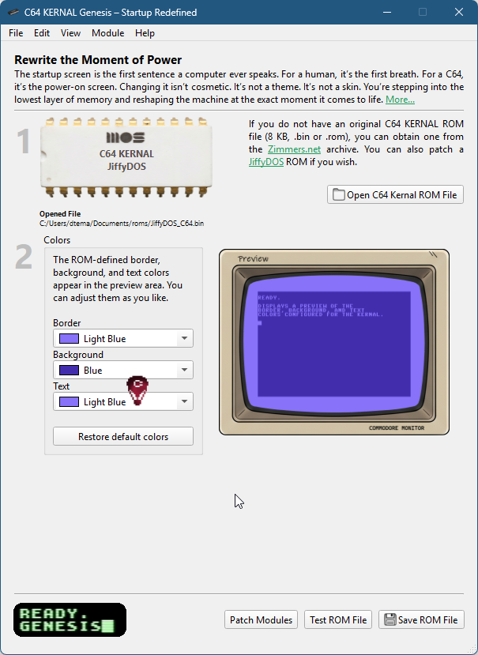

# C64KERNALGenesis
Rewrite the Moment of Power.  Your C64 doesn’t just say “READY.” anymore. It says it your way.

C64 KERNAL Genesis is a powerful desktop application that allows you to customize your Commodore 64 experience. By downloading the application from GitHub, you can easily apply various patches and modules to your KERNAL ROM.

The process is simple: download the tool, load your original ROM, select the modules you want to inject, and generate your new, personalized KERNAL.

#### More info
https://www.c64kernal.com/




## Build (Linux)

**This project requires Qt 6.11 or newer.**

### 1. Install Qt 6.11

Download and install Qt using the official installer:
https://www.qt.io/download

### 2. Build
```bash
git clone https://github.com/emartisoft/C64KERNALGenesis.git
cd C64KERNALGenesis

mkdir build
cd build

cmake -DCMAKE_PREFIX_PATH=/path/to/Qt/6.11/gcc_64 ..
cmake --build . -j
```
### 3. Notes

**Do not use system Qt packages (apt, dnf, etc.), they may be too old.**

Make sure CMAKE_PREFIX_PATH points to your Qt 6.11 installation.

## Run AppImage (Linux)
```bash
chmod +x C64KERNALGenesis-*.AppImage
./C64KERNALGenesis-*.AppImage
```
